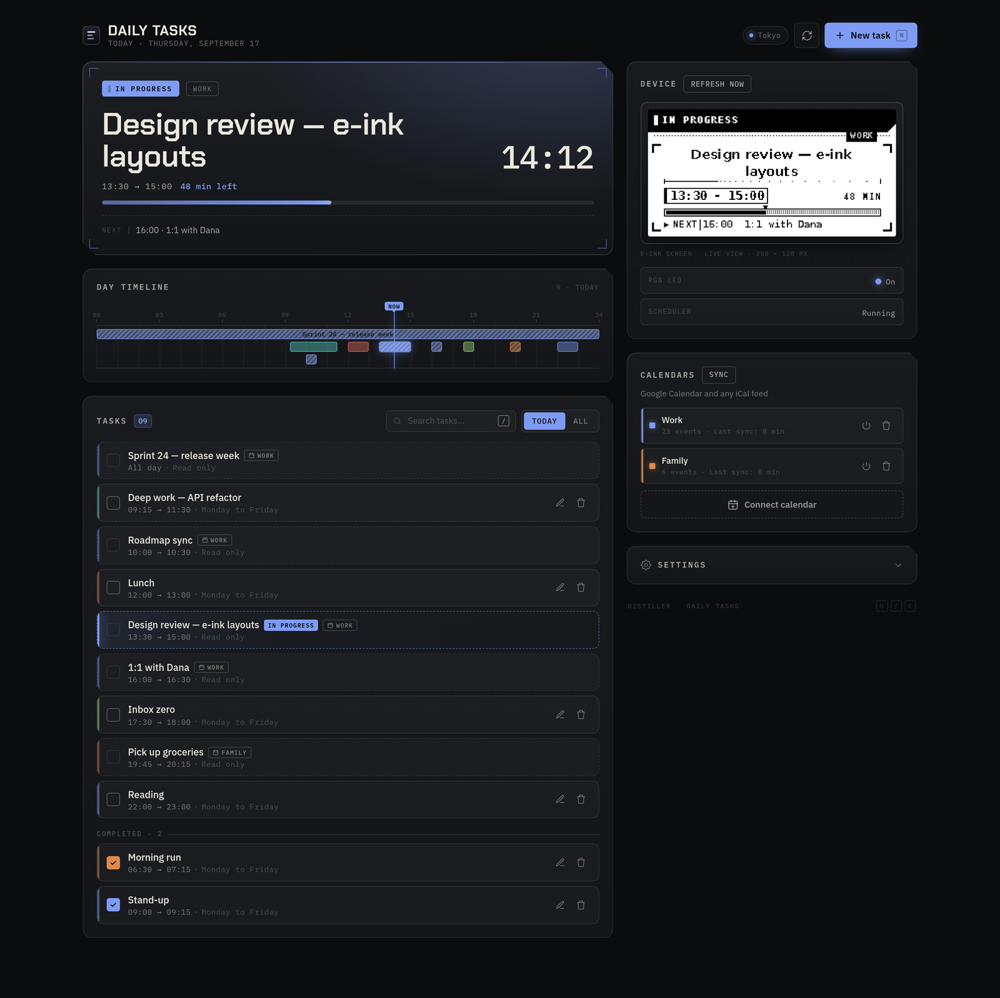
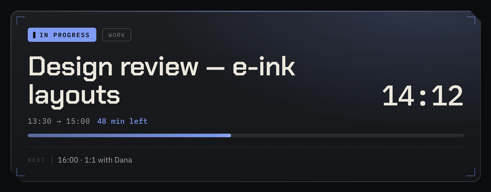
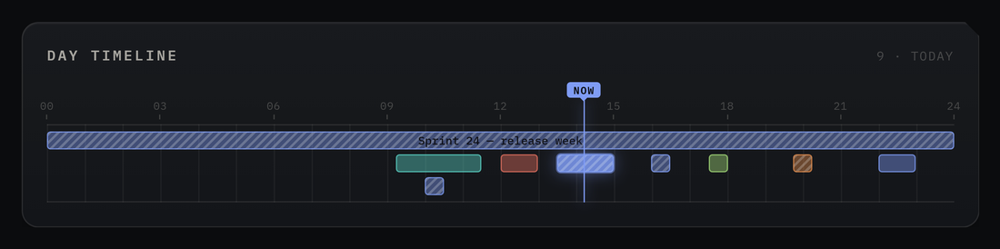
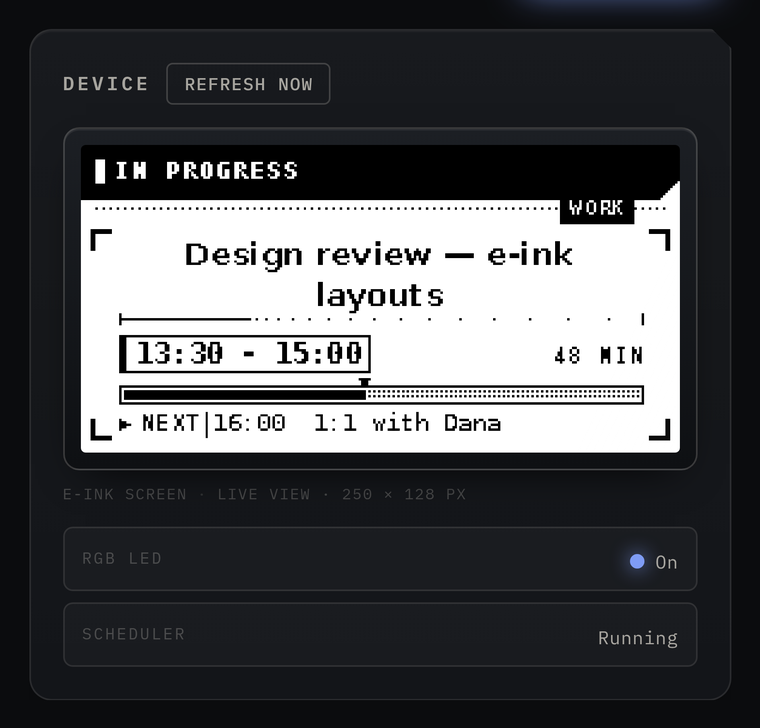
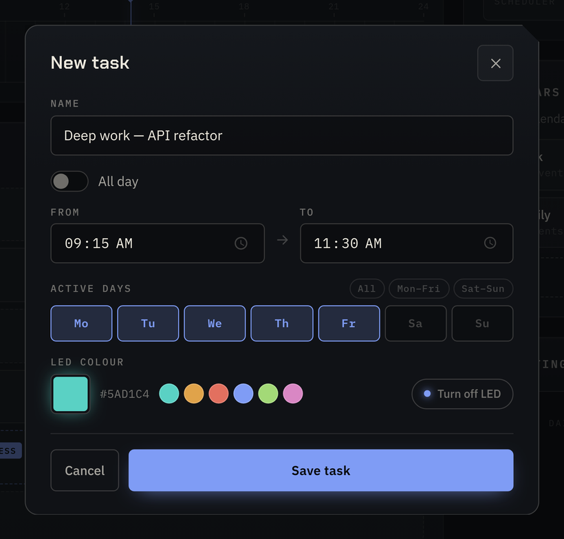
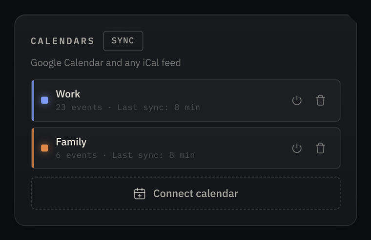
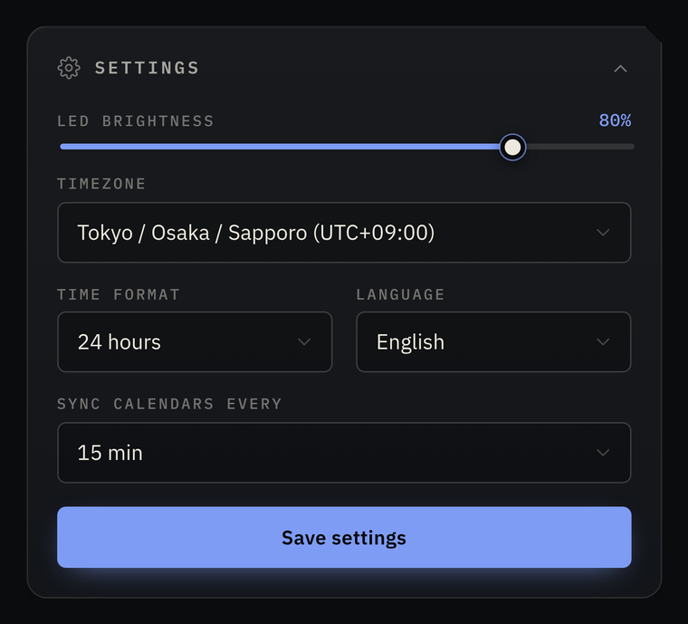
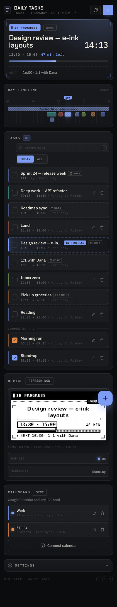
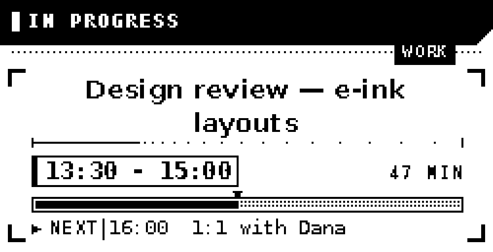
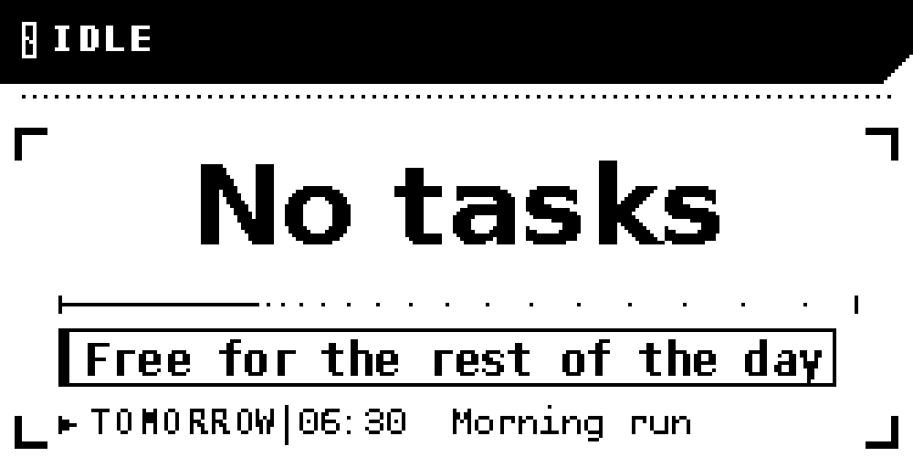

<div align="center">

# Daily Tasks

### Your day, on a screen that never blinks.

A self-hosted scheduling appliance for [Distiller](https://pamir.ai) devices: it merges
your tasks and your Google Calendar into one day, then shows what you should be doing
right now on a **250×128 e-ink panel** and an **RGB LED** you can read from across the room.

[](https://nodejs.org)
[](https://sqlite.org)
[](#quick-start)
[](#tech-stack)
[](#internationalisation)
[](https://pamir.ai)



</div>

---

## Why you might want this

**Calendar apps notify you. This one *is* the notification.** The panel sits on your desk
showing one thing — what is running now, how much of it is left, and what comes next — and
the LED turns the colour of whatever you are supposed to be doing. No pings, no tab to
keep open, no phone in your hand.

- ⚡ **Glanceable, not demanding.** E-ink means it is always on and never glows, blinks or
  animates at you. The LED encodes the whole state in a single colour.
- 📅 **Your real calendar, no OAuth circus.** Subscribe with a read-only iCal URL and your
  meetings flow into the day automatically. No Google Cloud project, no tokens, no write
  access to anything.
- 🔒 **Entirely yours.** One Node process, one SQLite file, zero telemetry, zero cloud.
- 🛠 **Boringly simple to hack.** Vanilla JS, no framework, no bundler, no build step.
  Edit a file, reload the page.

---

## See it

<table>
<tr>
<td width="50%" valign="top">

**The instrument**

What is running, the live clock, time remaining and a progress bar — sized to be read,
not scanned.



</td>
<td width="50%" valign="top">

**The day timeline**

The whole day as blocks with a playhead. Overlapping items are packed onto rows; all-day
items get their own band.



</td>
</tr>
<tr>
<td width="50%" valign="top">

**The device, mirrored**

A live view of the exact frame on the e-ink panel, plus LED and scheduler state.



</td>
<td width="50%" valign="top">

**Tasks in seconds**

Name, time range, weekdays, all-day, LED colour. Keyboard-first: <kbd>N</kbd> new,
<kbd>/</kbd> search, <kbd>R</kbd> refresh, <kbd>Esc</kbd> close.



</td>
</tr>
<tr>
<td width="50%" valign="top">

**Calendars**

Subscribe to any iCal feed, give it a colour, pause it, or force a sync.



</td>
<td width="50%" valign="top">

**Settings**

LED brightness, timezone (38 zones with UTC offset and a DST indicator), 12/24-hour,
language, sync interval.



</td>
</tr>
</table>

<div align="center">

<br><em>…and it collapses to one column on a phone.</em>
</div>

### What the panel actually shows

<div align="center">




<em>Real 250×128 frames, upscaled 4×. Every shade you see is an ordered dither pattern —
the panel is strictly 1-bit.</em>

</div>

---

## Quick start

> Requires Node ≥ 16. The LED and e-ink panel need the Distiller SDK at
> `/opt/distiller-sdk`; without it everything else still runs and hardware output is
> simply skipped.

```bash
cd daily-tasks/backend
npm install

cd ..
bash start.sh           # or: PORT=5000 node backend/server.js
```

Open **http://localhost:5000**, press <kbd>N</kbd>, and create your first task.
To reach it from another machine, expose it through the Distiller reverse proxy
(see the `port-proxy` skill).

---

## Connect a Google Calendar

Subscriptions are **read-only iCal feeds**. Nothing is ever written back, and no Google
Cloud project, OAuth client or token refresh is involved.

1. In Google Calendar open **Settings** → pick the calendar → **Integrate calendar**.
2. Copy the **Secret address in iCal format** (this also works for calendars shared with you).
3. In the panel: **Calendars → Connect calendar**, paste the address, pick an LED colour.

> [!WARNING]
> That address grants read access to the calendar. Treat it like a password.

**How events behave**

- Occurrences are expanded — `RRULE` recurrences, overrides and `EXDATE` included — for a
  window of −2 to +21 days, and cached locally.
- Events appear in the day alongside your tasks, marked read-only, and drive the LED and
  the e-ink panel exactly like a task.
- Timed, all-day and multi-day events are all handled; multi-day events are clamped to
  each day they touch.
- Re-synced on your interval (5–180 minutes, default 15).

**When several things overlap**, a concrete appointment beats an all-day backdrop, and
among overlapping appointments the most recently started one wins — the one you just
walked into.

---

## How it works

```
                    ┌──────────────────────────────────────────┐
  iCal feeds ──────▶│ calendar-sync.js   (every 5–180 min)     │
  (read-only)       │  fetch → expand recurrences → cache      │
                    └───────────────┬──────────────────────────┘
                                    │
  web panel ──REST──▶ server.js ───▶│         ┌───────────────┐
                                    ▼         │ tasks (SQLite)│
                              agenda.js ◀─────┴───────────────┘
                     "what is running, what is next, how far along"
                                    │
                    ┌───────────────┴────────────────┐
                    ▼                                ▼
             led-controller.js              display-controller.js
                    │                                │
                 RGB LED                       e-ink panel
```

`scheduler.js` evaluates the current moment every minute — and immediately after any
change you make — so the web panel, the LED and the screen can never disagree.

<details>
<summary><b>Design notes: the e-ink panel</b></summary>

<br>

The panel is 250×128 and strictly 1-bit — no greys. `render_display.py` is built around
three rules:

1. **Nothing is ever clipped.** Every string is fitted (shrink → wrap → hard-break →
   ellipsise). If a title still would not fit, the renderer drops the "next up" row to
   buy the title another line rather than truncating what you actually need to read.
2. **Depth without greys.** Panels, the progress track and the title's drop shadow are
   ordered dither patterns drawn pixel by pixel, so they survive the 1-bit conversion
   exactly as authored.
3. **Landscape in, firmware rotates.** Frames are authored 250×128; the vendor firmware
   handles rotation.

Refreshes are managed. A **full** refresh (≈2–3 s, flashes the panel) only happens when
the content actually changes, while minute-to-minute clock and progress updates ride
**partial** refreshes (≈0.5 s, no flash). A full refresh is forced back in every 20
partials to clear the ghosting partials leave behind.

</details>

<details>
<summary><b>Design notes: nothing blocks the API</b></summary>

<br>

Both the e-ink render and the LED spawn Python processes, and a full e-ink refresh takes
seconds. Neither ever runs inline with an HTTP request: each has a single-slot queue
where a newer frame or colour simply replaces a queued one, because only the newest state
is worth drawing. API mutations return in milliseconds instead of waiting for hardware.

</details>

<details>
<summary><b>Design notes: scheduling edge cases</b></summary>

<br>

- **Midnight-crossing tasks** (e.g. `23:00 → 01:00`) are handled, progress included.
- **All-day tasks** track progress through the whole day.
- **Done tasks** are excluded from the schedule but stay in the list.
- **Multi-day calendar events** are clamped per day and flagged as continuing.
- Everything is computed in your configured timezone, never the host clock.

</details>

---

## REST API

<details>
<summary><b>Tasks</b></summary>

<br>

```
GET    /api/tasks              List all tasks
GET    /api/tasks/:id          One task
POST   /api/tasks              Create
PUT    /api/tasks/:id          Update
PATCH  /api/tasks/:id/done     Toggle done
DELETE /api/tasks/:id          Delete (echoes the row back, so the UI can offer undo)
```

```bash
curl -X POST http://localhost:5000/api/tasks \
  -H 'Content-Type: application/json' \
  -d '{"name":"Deep work","start_time":"09:15","end_time":"11:30","led_color":"90,209,196","active_days":"1,2,3,4,5"}'
```

</details>

<details>
<summary><b>Calendars</b></summary>

<br>

```
GET    /api/calendars          Subscriptions + sync state
POST   /api/calendars          Subscribe (the feed is validated before it is stored)
PUT    /api/calendars/:id      Rename, recolour or pause
DELETE /api/calendars/:id      Unsubscribe and drop its cached events
POST   /api/calendars/sync     Force a sync of every enabled subscription
```

</details>

<details>
<summary><b>Agenda, config and device</b></summary>

<br>

```
GET    /api/agenda?date=        Merged tasks + events for one day (defaults to today)
GET    /api/config              Global configuration
PUT    /api/config              Update configuration
GET    /api/status              Active item, next item, progress, full day agenda
GET    /api/display/preview.png The frame currently on the e-ink panel
POST   /api/refresh             Force a full refresh of display and LED
GET    /api/health              Health check
```

</details>

Every response uses the same envelope: `{ "success": true, "data": … }` or
`{ "success": false, "error": "…" }`.
Full request/response contracts: [`docs/agents/api.md`](docs/agents/api.md).

---

## Configuration

| Setting | Default | Range |
|---|---|---|
| `brightness` | `100` | 0–100 |
| `timezone` | `America/Los_Angeles` | any IANA zone (38 curated in the picker) |
| `time_format` | `24` | `24` or `12` |
| `language` | `es` | `es` or `en` |
| `calendar_sync_minutes` | `15` | 5–180 |

Stored in the `config` table and editable from the settings panel.
Schema details: [`docs/agents/data-model.md`](docs/agents/data-model.md).

---

## Project layout

```
daily-tasks/
├── backend/
│   ├── server.js              Express server + REST API
│   ├── database.js            SQLite + prepared statements
│   ├── agenda.js              Merges tasks + calendar events into one day
│   ├── scheduler.js           Evaluates the current moment, drives LED + panel
│   ├── calendar-sync.js       iCal fetch + recurrence expansion
│   ├── led-controller.js      RGB LED control (async, coalesced)
│   ├── display-controller.js  E-ink payload building + render queue
│   ├── render_display.py      1-bit HUD renderer (PIL)
│   └── i18n.js                Backend translation helper
├── frontend/
│   ├── index.html             Control panel markup
│   ├── styles.css             "Instrument" design system
│   ├── i18n.js                Frontend i18n runtime (catalogs bundled inline)
│   └── app.js                 Frontend logic
├── locales/                   es.json · en.json · timezones.json
├── database/                  tasks.db · last rendered frame
└── docs/agents/               Reference documentation for AI agents
```

---

## Internationalisation

The interface ships in **English and Spanish**, switchable at runtime. Backend and e-ink
strings live in `locales/*.json`; the panel bundles its own catalogs in
`frontend/i18n.js` so it needs no extra round trip. Markup is translated declaratively
through `data-i18n*` attributes. Adding a language is a five-file change — see
[`docs/agents/recipes.md`](docs/agents/recipes.md).

---

## Troubleshooting

<details>
<summary><b>The LED does not change colour</b></summary>

<br>

- Check that something is actually active right now, and that it has a colour assigned.
- The SDK path uses `create_led_with_sudo()` — a permission problem looks like a hardware
  problem in the log.
- After a hardware error the controller stops retrying until the server restarts.

</details>

<details>
<summary><b>The e-ink panel does not update</b></summary>

<br>

- `GET /api/display/preview.png` shows the last frame that was rendered — if it is
  correct, rendering works and the issue is the push to hardware.
- A frame identical to the previous one is skipped on purpose. Force it with
  `curl -X POST http://localhost:5000/api/refresh`.
- Render without touching hardware to isolate the problem:

```bash
PYTHONPATH=/opt/distiller-sdk/src /opt/distiller-sdk/.venv/bin/python3 \
  backend/render_display.py database/display_payload.json
```

(set `"push": false` in the payload to render to a PNG only)

</details>

<details>
<summary><b>A calendar shows a sync error</b></summary>

<br>

- Hover the badge for the exact message.
- Re-copy the secret iCal address; Google invalidates it if the calendar is reset.
- The feed must be reachable from the device (check outbound HTTPS).
- Events cached from the last successful sync keep working meanwhile.

</details>

<details>
<summary><b>Port already in use</b></summary>

<br>

```bash
PORT=8000 node backend/server.js
```

</details>

More: [`docs/agents/troubleshooting.md`](docs/agents/troubleshooting.md).

---

## Tech stack

| Layer | Choice |
|---|---|
| Backend | Node.js + Express |
| Database | SQLite (`better-sqlite3`, WAL) |
| Scheduler | `node-cron`, every minute |
| Calendar | `ical-expander` + Luxon |
| Frontend | HTML5 + CSS3 + vanilla JavaScript — no framework, no build |
| Type | Chakra Petch (display), IBM Plex Sans / Mono |
| LED | Distiller SDK (`distiller_sdk.hardware.sam`) |
| E-ink | Distiller SDK (`distiller_sdk.hardware.eink`) + Pillow |

Six runtime dependencies, total.

---

## Working on this with an AI agent

The repository ships machine-oriented documentation so an agent can get full context
without reading the source: start at [`AGENTS.md`](AGENTS.md), which routes to focused
reference pages in [`docs/agents/`](docs/agents/) covering the API, data model,
architecture, frontend, e-ink renderer, common recipes and troubleshooting.

---

## License

Project developed for Distiller devices.

<div align="center">

**Built with Claude Code** · Made on [Distiller](https://pamir.ai)

</div>
